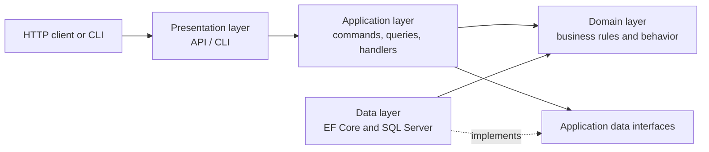
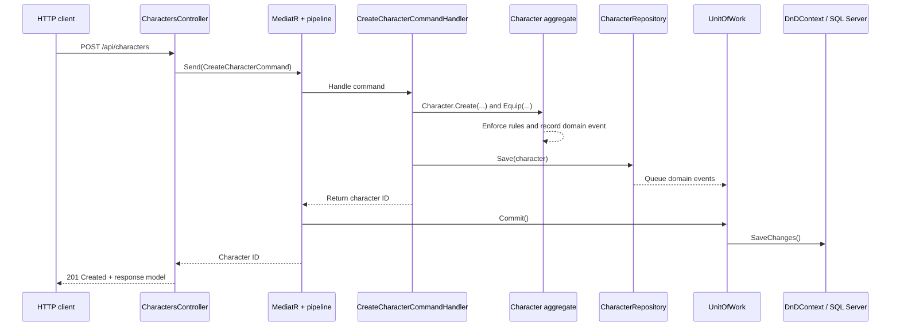
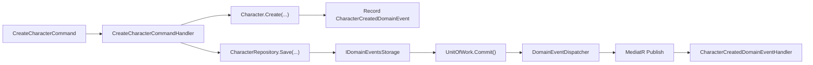
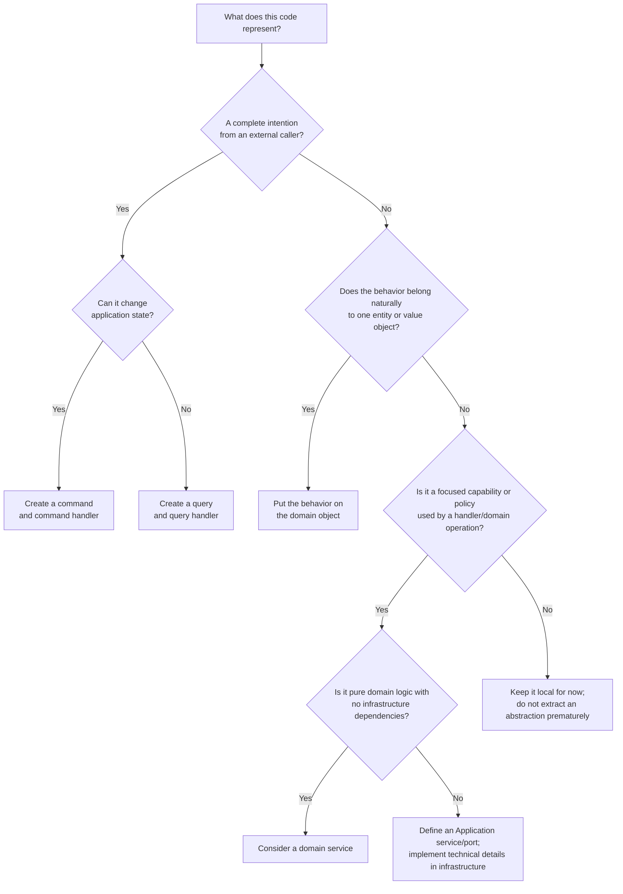
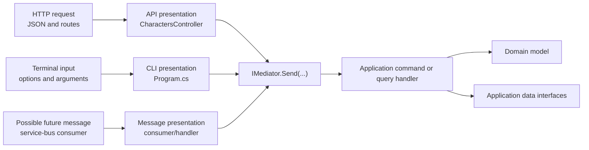

# D&D API: Layered Architecture, DDD, and CQRS

This bootcamp project is a small Dungeons & Dragons character API. Its real purpose is to demonstrate how an application can be divided into layers and how patterns such as **Domain-Driven Design (DDD)**, **CQRS**, **Mediator**, and **Unit of Work** work together.

Do not worry if these terms are new. Each pattern answers a practical question:

| Question | Pattern used here |
| --- | --- |
| Where should a rule such as “a character cannot equip an unusable weapon” live? | Domain-Driven Design |
| How do we keep reads simple without weakening the rules for writes? | CQRS |
| How does a controller find the code that handles its request? | Mediator |
| How do several changes become one completed operation? | Unit of Work |
| How do we avoid exposing database or domain objects through HTTP? | Request/response models |
| How do we keep HTTP, business rules, and SQL concerns separate? | Layered Architecture |

## Table of contents

- [The architecture at a glance](#the-architecture-at-a-glance)
- [Follow one request through the layers](#follow-one-request-through-the-layers)
- [Domain-Driven Design (DDD)](#domain-driven-design-ddd)
- [Event-Driven Architecture](#event-driven-architecture)
- [CQRS: commands and queries](#cqrs-commands-and-queries)
- [Mediator and MediatR](#mediator-and-mediatr)
- [The mediator pipeline and Unit of Work](#the-mediator-pipeline-and-unit-of-work)
- [Commands and queries versus services](#commands-and-queries-versus-services)
- [More than one presentation layer](#more-than-one-presentation-layer)
- [Request, response, command, domain, and data models](#request-response-command-domain-and-data-models)
- [Responsibilities and dependency rules](#responsibilities-and-dependency-rules)
- [Adding a new feature](#adding-a-new-feature)
- [Running the project](#running-the-project)
- [Key takeaways](#key-takeaways)
- [Homework blueprint](#homework-blueprint)

## The architecture at a glance

The solution uses four primary projects:

| Project (layer) | Responsibility | Examples |
| --- | --- | --- |
| `Zeal.Bootcamp.DnD.Api` (presentation) | HTTP routes, input/output contracts, and application startup | `CharactersController`, `CreateCharacterRequest` |
| `Zeal.Bootcamp.DnD.Application` (use cases) | Commands, queries, handlers, orchestration, and abstractions needed by a use case | `CreateCharacterCommandHandler`, `UnitOfWorkBehavior` |
| `Zeal.Bootcamp.DnD.Domain` (business model) | Business concepts, behavior, rules, and domain events | `Character`, `CharacterName`, `Weapon` |
| `Zeal.Bootcamp.DnD.Data` (infrastructure) | Entity Framework Core, SQL Server mappings, repositories, and concrete data queries | `DnDContext`, `CharacterRepository` |

`Zeal.Bootcamp.DnD.Cli` is a second presentation layer. It invokes the same application commands and queries without HTTP, demonstrating that the application and domain are not tied to a web API.



The important direction is **toward the business logic**. The Application project defines interfaces such as `ICharacterRepository`; the Data project implements them. This is dependency inversion: the use case says what storage capability it needs, while infrastructure decides how to provide it.

## Follow one request through the layers

Creating a character shows nearly every major concept in the project:



Notice that the controller does not create EF entities and the handler does not call `SaveChanges`. Each layer has one kind of job.

## Domain-Driven Design (DDD)

DDD means modeling software around the language, rules, and behavior of the problem being solved. Here, the problem language includes characters, classes, weapons, inventories, and experience—not database rows or HTTP status codes.

### Entities and value objects

An **entity** has an identity that continues over time. A character remains the same character when its name or weapon changes, because its `Id` remains the same. The shared `Entity<TIdentifier>` base class implements identity-based equality.

A **value object** is defined by its values rather than an independent identity. `CharacterName` is a good example:

```csharp
public CharacterName(string value)
{
    value = value?.Trim() ?? string.Empty;
    if (value.Length is < 2 or > 50)
        throw new DomainException(
            "A character name must be between 2 and 50 characters.");

    Value = value;
}
```

This keeps the rule close to the concept. Once a `CharacterName` exists, other code can trust that it is valid. The rule is enforced whether the character was created through the API, CLI, or a future user interface.

### Aggregates and aggregate roots

An **aggregate** is a group of domain objects that must remain consistent together. Its **aggregate root** is the only object outside code should use to change that group.

`Character` is the aggregate root for its inventory and experience tracker. Its child objects are private, and callers receive immutable snapshots:

```csharp
private readonly ExperienceTracker _experience;
private readonly Inventory _inventory;

public ExperienceSnapshot Experience => _experience.ToSnapshot();
public InventorySnapshot Inventory => _inventory.ToSnapshot();
```

Changes go through methods such as `AddItem`, `Equip`, and `AwardExperience`. For example, `AddItem` rejects a weapon the character's class cannot use. This protects the aggregate from entering an invalid state.

An aggregate is also a **consistency boundary**: load it, perform behavior through its root, and save the resulting state as one logical operation.

### Domain events

A **domain event** records that something meaningful happened in the business domain. `Character.Create(...)` adds a `CharacterCreatedDomainEvent`; `AwardExperience(...)` adds an `ExperienceAwardedDomainEvent`.

The aggregate records the event but does not know who reacts to it. During commit, the application dispatches the event through MediatR. `CharacterCreatedDomainEventHandler`, for example, logs that the character was created. This separates the core action from its side effects and makes additional reactions easier to add.

## Event-Driven Architecture

**Event-Driven Architecture (EDA)** is a style in which one part of a system announces that something happened and other parts react to that announcement. The sender does not need to call every interested receiver directly.

An event is written in the past tense because it describes a fact:

- `CharacterCreatedDomainEvent` means a character **was created**.
- `ExperienceAwardedDomainEvent` means experience **was awarded**.

This differs from a command. `CreateCharacterCommand` asks the application to perform an action and has one handler. `CharacterCreatedDomainEvent` reports the result of that action and can have zero, one, or many handlers.

```text
Command: "Create this character"       -> one handler performs the use case
Event:   "A character was created"     -> any interested handlers may react
```

### How events flow through this project



The steps are:

1. `Character.Create(...)` records a `CharacterCreatedDomainEvent` inside the aggregate.
2. `CharacterRepository.Save(...)` calls `character.PullEvents()` and places those events in `IDomainEventsStorage`.
3. After the command handler returns, `UnitOfWorkBehavior` asks `UnitOfWork` to commit.
4. `UnitOfWork.Commit(...)` drains the event queue and passes each event to `DomainEventDispatcher`.
5. `DomainEventDispatcher` wraps the domain event as a MediatR notification and publishes it.
6. MediatR invokes interested notification handlers. The current `CharacterCreatedDomainEventHandler` writes a log entry.

This design keeps `Character` focused on business behavior. It knows that creation is significant, but it does not know about logging, email, analytics, or other possible reactions.

### Events and the Unit of Work

Events are coordinated with the command's Unit of Work. Before database changes are saved, the unit of work dispatches queued domain events and pre-transaction notifications. If a handler causes another domain event, the loop continues until the event queue is empty. It then saves the data and runs deferred and post-transaction notifications.

That ordering lets a notification choose when its reaction should occur:

- **Before persistence** when the reaction belongs to the same logical operation.
- **After persistence** when it should happen only after database changes succeed.
- **Batched** when several related notifications should be processed together.

The `DeferExecutionUntilUnitOfWorkIsCompleteAttribute` and `BatchNotificationsAttribute` support these choices. For bootcamp purposes, the central lesson is that event timing matters: sending an email before a database operation succeeds could tell a user about something that was never saved.

### What kind of EDA is this?

This project currently uses **in-process domain events**. MediatR delivers events to handlers inside the same running API or CLI process. This provides decoupled application code, but it is not yet a distributed event-driven system.

| In-process events in this project | External integration events |
| --- | --- |
| Delivered through MediatR | Usually delivered through a broker such as Azure Service Bus, RabbitMQ, or Kafka |
| Handlers run in the same process | Consumers may run in other services or processes |
| No network serialization is needed | Events require a stable, serializable contract |
| Delivery ends if the process fails | A durable broker can retain messages for later processing |
| Useful for domain and application reactions | Useful for communication between independently deployed systems |

If this application later publishes events to an external message broker, it should normally use a durable pattern such as the **Transactional Outbox**. The database change and an outgoing-event record are saved in the same transaction; a separate publisher then sends that record to the broker. This avoids losing an event if the database commit succeeds but the process crashes before publishing.

External consumers should also be **idempotent**, meaning processing the same event more than once has the same effect as processing it once. Most distributed brokers guarantee at-least-once delivery rather than exactly-once processing.

Domain events and integration events are related but need not be identical. A domain event can contain details useful inside this domain, while an integration event should expose only the stable information another system needs.

## CQRS: commands and queries

**Command Query Responsibility Segregation (CQRS)** means using different models and paths for changing state and reading state.

- A **command** asks the system to do something and may change state: `CreateCharacterCommand`.
- A **query** asks for information and must not change state: `ListCharactersQuery`.

This project uses a practical, lightweight form of CQRS. Commands and queries use the same SQL database, but their code paths are separate.

### The command path

`CreateCharacterCommandHandler` converts command data into domain concepts, asks the `Character` aggregate to perform its behavior, and saves it through `ICharacterRepository`:

```csharp
Character character = Character.Create(
    request.Name,
    characterClass,
    startingWeapons: [weapon]);

character.Equip(weapon);
await characterRepository.Save(character);
```

The write path uses the rich domain model because changes must obey business rules.

### The query path

`ListCharactersQueryHandler` delegates to `IListCharactersDataQuery`. Its Data implementation uses `AsNoTracking()` and projects directly from EF entities into `ListCharactersDataQueryResult`:

```csharp
db.Set<CharacterEntity>()
    .AsNoTracking()
    .Select(character => new ListCharactersDataQueryResult { /* fields */ });
```

The read path does not rebuild a `Character` aggregate because it is not performing domain behavior. It selects only the shape needed by the caller. This is simpler and often more efficient.

`ODataController` returns this queryable result and applies `[EnableQuery]`, allowing clients to shape the read with supported OData options. That flexibility belongs on the read side, not on a command that changes state.

CQRS does **not** require two databases, event sourcing, or distributed services. Those are possible advanced designs, but the essential idea is simply that reads and writes have different responsibilities.

## Mediator and MediatR

The **Mediator pattern** routes a request to its handler. Instead of a controller depending directly on every use-case service, it depends on `IMediator` and sends a message:

```csharp
Guid characterId = await mediator.Send(command, cancellationToken);
```

MediatR finds `CreateCharacterCommandHandler`, whose `IRequestHandler<CreateCharacterCommand, Guid>` declaration states exactly what it handles and returns.

This provides:

- thin presentation code;
- one focused handler per use case;
- a shared pipeline for cross-cutting work;
- application use cases that can be called from both the API and CLI.

Mediator is not "magic business logic." It is dispatch plumbing. The handler still orchestrates the use case, and the domain still owns the business rules.

## The mediator pipeline and Unit of Work

A **Unit of Work** treats all changes made by one use case as a single logical operation. Callers should not have to remember when to dispatch domain events or save EF changes.

MediatR pipeline behaviors wrap a handler much like middleware wraps an HTTP endpoint:

```text
request -> UnitOfWorkBehavior -> command handler -> UnitOfWorkBehavior -> response
```

`UnitOfWorkBehavior<TRequest, TResponse>` inspects each MediatR request:

- If it is a `CommandBase`, the behavior runs it inside the unit-of-work flow.
- If it is a query, the behavior calls the next step without committing.
- After the outermost command handler succeeds, it calls `unitOfWork.Commit(...)`.
- If the handler throws, execution never reaches `Commit`, so failed commands are not deliberately saved by the pipeline.

Why track `CallLevel`? A command handler or event reaction can send another command. Without nesting awareness, every inner command could commit independently. `UnitOfWorkBehaviorState` ensures that only the outermost command commits:

```text
outer command (level 1)
  inner command (level 2) -> no commit
outer command resumes       -> one commit
```

The behavior also initializes notification managers at the start of the outermost command. `UnitOfWork.Commit` then performs the coordinated completion sequence:

1. Dequeue and dispatch domain events.
2. Run pre-transaction batched notifications.
3. Repeat if handlers created more domain events.
4. Call `IDataStore.SaveChanges()` once the event queue is drained.
5. Run deferred and post-transaction notifications.

`DnDContext` implements `IDataStore`, so the Application layer can request a save without depending directly on Entity Framework Core.

The repository's `Save` method prepares tracked persistence entities and queues the aggregate's events; it intentionally does not call `SaveChanges`. The pipeline owns the commit boundary.

> A useful distinction: the application-level Unit of Work coordinates the whole use case. `DnDContext` additionally opens an explicit database transaction for the special two-step insert needed when a new character references its newly inserted equipped inventory item.

## Commands and queries versus services

Many codebases organize most business operations into large classes named `SomethingService`. Moving to CQRS and MediatR can therefore feel like replacing a familiar pattern with many unfamiliar files. The key difference is not the class name or library—it is the responsibility assigned to each object.

- A **command** represents one request to change application state.
- A **query** represents one request to retrieve information without changing state.
- A **handler** coordinates the complete use case represented by that command or query.
- A **service** provides a focused capability that a handler or domain object can use as one step in a use case.

Think of commands and queries as the application's menu: they describe what a caller is allowed to ask the application to do. Think of services as reusable building blocks in the kitchen: they help fulfill those requests but are not usually entry points themselves.

| Concern | Command or query | Service |
| --- | --- | --- |
| Represents | A complete application use case | A focused capability or policy |
| Typical name | `CreateCharacterCommand`, `ListCharactersQuery` | `DamageCalculator`, `CharacterEligibilityChecker` |
| Invoked by | API, CLI, worker, or message adapter through MediatR | A handler or domain object through a direct dependency |
| Scope | One caller intention from beginning to end | One reusable part of that intention |
| Owns transaction boundary | A command participates in the mediator Unit of Work | No; it operates inside the caller's boundary |
| Returns | The use-case result or read model | A calculation, decision, or focused operation result |
| May change state | Commands do; queries do not | Only as explicitly required by its focused responsibility |
| Should know HTTP or console details | No | No |

### A familiar service-style design

Without CQRS, a controller might inject a large `CharacterService`:

```csharp
public sealed class CharacterService
{
    public Task<Guid> Create(...);
    public Task Rename(...);
    public Task AwardExperience(...);
    public Task<IReadOnlyList<CharacterDto>> List(...);
    public Task<CharacterDto?> Get(...);
}
```

This can work in a small application, but the class tends to grow with every feature. It mixes reads and writes, becomes a dependency for unrelated callers, and provides no obvious place to apply behavior to only commands or only queries. Developers may also start putting validation, orchestration, mapping, persistence, and calculations into the same service.

In the CQRS design, each use case has an explicit request and one handler:

```text
CreateCharacterCommand  -> CreateCharacterCommandHandler
RenameCharacterCommand  -> RenameCharacterCommandHandler
ListCharactersQuery     -> ListCharactersQueryHandler
GetCharacterQuery       -> GetCharacterQueryHandler
```

This makes the application's capabilities easy to find and allows the mediator pipeline to treat commands and queries differently. For example, this project commits a Unit of Work after a command but not after `ListCharactersQuery`.

### Handlers orchestrate; services contribute

A handler should read like the short story of one use case. It coordinates the steps, while domain objects and small services perform focused work:

```csharp
public async Task<Guid> Handle(
    CreateCharacterCommand command,
    CancellationToken cancellationToken)
{
    Class characterClass = classCatalog.Find(command.ClassName);
    Weapon weapon = weaponCatalog.Find(command.Weapon);

    Character character = Character.Create(
        command.Name,
        characterClass,
        startingWeapons: [weapon]);

    character.Equip(weapon);
    await characterRepository.Save(character);

    return character.Id;
}
```

In the project, `IClassCatalog` and `IWeaponCatalog` are small Application services implemented by `ClassCatalog` and `WeaponCatalog`. They resolve known game concepts; they do not own the entire create-character workflow. `Character` still owns rules about its valid state, and the handler still makes the sequence of the use case visible. Because the catalogs are stateless, they are registered as singletons in `AddApplicationServices` and can be reused by future handlers.

Small services become useful building blocks because multiple handlers can assemble them in different ways:

```text
Create character = class lookup + weapon lookup + Character.Create + repository
Change class     = class lookup + eligibility check + Character.ChangeClass + repository
Equip weapon     = weapon lookup + Character.Equip + repository
```

The goal is not to maximize the number of services. Extract a service when a capability has a clear name, a focused contract, and genuine value outside one handler—or when it represents an external dependency that must sit behind an interface. A three-line private method used by one handler does not automatically need its own class.

### Common kinds of services

The word “service” is broad, so identifying its role helps determine where it belongs.

**Domain service:** domain logic that does not naturally belong to one entity or value object. It uses domain language and types and does not depend on HTTP, EF Core, or external vendors. For example, a combat-resolution policy involving two aggregates might be a domain service. Prefer behavior on the entity when that entity has enough information to enforce the rule itself.

**Application service:** a reusable use-case capability or policy, such as checking eligibility, calculating a deadline from application inputs, or coordinating access to an application-defined port. It belongs in Application and can be injected into handlers.

**Infrastructure service:** a concrete technical capability such as sending email, reading the system clock, generating files, or calling an external API. Application normally defines the interface it needs; Data or another infrastructure project implements it.

**Hosted/background service:** a continuously running .NET worker. This use of “service” describes a hosting mechanism, not a business-logic class. It can act as a presentation adapter by receiving scheduled work or messages and sending commands or queries.

### Decision tree

Use the following questions when deciding what to create:



A shorter checklist is:

1. If an API, CLI, worker, or message consumer is asking the application to **do something**, use a command.
2. If it is asking the application to **return information without side effects**, use a query.
3. If logic protects the valid state of one domain object, put it on that domain object.
4. If focused logic supports several use cases, consider a small service.
5. If code talks to a database, clock, file system, email provider, or external API, define a narrow Application interface and implement it in infrastructure.

### Practical boundaries

**Do not use a command as a reusable function.** A command is a top-level use-case message, not a utility method. One handler repeatedly sending other commands can hide control flow and complicate transaction ownership. Prefer extracting the shared step into a service or domain method and inject it into both handlers. Sending a nested command is appropriate only when it truly represents a separate application use case whose pipeline behavior is intentional.

**Do not put side effects in queries.** A query should not save changes, publish business events, send email, or update “last viewed” state. If the operation changes observable state, model that change as a command.

**Do not make handlers empty forwarding wrappers.** If every handler only calls one large service method such as `characterService.Create`, the old service architecture still owns the use cases and MediatR adds ceremony without clarity. Move use-case orchestration into the handler and leave focused, reusable capabilities in services.

**Do not move entity behavior into services.** A `CharacterService.Equip(character, weapon)` method should not bypass or duplicate `Character.Equip(weapon)`. The aggregate must protect its own invariants regardless of which handler or service calls it.

**Do not inject MediatR into domain objects.** Domain objects record domain events; the Application layer dispatches them. This keeps the domain independent of the mediator library and application workflow.

### A safe migration path for an existing service-based application

Teams do not need to rewrite every service at once. Migrate one vertical slice:

1. Choose one controller action and identify the caller's complete intention.
2. Create a command or query representing that intention.
3. Move the use-case sequence from the controller or large service method into its handler.
4. Keep existing focused service dependencies and call them from the handler.
5. Move business invariants into domain objects where they belong.
6. Extract smaller services only when repeated capabilities become visible.
7. Route the controller through MediatR and verify behavior before migrating another action.

The result should not be “services are bad.” The result should be **clear use-case entry points plus small, composable services**. Commands and queries describe what the application does; handlers assemble domain behavior and service building blocks to do it.

## More than one presentation layer

The presentation layer is sometimes mistaken for "the API." An API is only one way for a user or another system to enter the application. A command-line interface, desktop application, scheduled job, or service-bus consumer can be another presentation layer.

This solution deliberately includes two presentations:

- `Zeal.Bootcamp.DnD.Api` translates HTTP requests into application commands and queries, then translates results into HTTP responses.
- `Zeal.Bootcamp.DnD.Cli` translates command-line arguments into the same application commands and queries, then formats results for a terminal.

Both are thin adapters around the Application layer:



Each presentation is responsible only for concerns belonging to its input and output mechanism. The API understands routes, JSON, HTTP status codes, and response contracts. The CLI understands command names, options, console tables, and process exit codes. Neither should reimplement the create-character business use case.

### The same use case from HTTP and the terminal

The API maps its transport-specific request model to an application command:

```csharp
var command = new CreateCharacterCommand
{
    Name = request.Name,
    ClassName = request.ClassName,
    Weapon = request.Weapon,
};

Guid characterId = await mediator.Send(command, cancellationToken);
return Created($"api/characters/{characterId}", new CreateCharacterResponse
{
    Id = characterId,
});
```

The CLI maps command-line options to that exact same command:

```csharp
var command = new CreateCharacterCommand
{
    Name = name.Value()!,
    ClassName = className.Value()!,
    Weapon = weapon.Value()!,
};

Guid characterId = await mediator.Send(command, cancellationToken);
Console.WriteLine($"Character created with Id: {characterId}");
```

The input and output differ, but everything after `mediator.Send(...)` is shared:

1. MediatR runs the same pipeline behaviors.
2. `CreateCharacterCommandHandler` performs the same use case.
3. `Character` enforces the same domain rules.
4. The same repository and Unit of Work persist the result.
5. The same domain events and notification handlers run.

The list operation follows the same idea. `ODataController` and the CLI both send `ListCharactersQuery`. The API exposes the result through HTTP and OData; the CLI materializes it and prints a table. Query behavior belongs in Application and Data, while output formatting belongs in the presentation that requested it.

### Why this separation is valuable

**Business behavior stays consistent.** A character name cannot bypass validation merely because it came from a terminal instead of HTTP. Both presentations eventually call `Character.Create(...)` through the same handler.

**New entry points are inexpensive.** Adding a graphical interface or worker does not require copying use-case logic. The new adapter parses its input, constructs the existing command or query, sends it, and formats the result.

**Transport changes have a smaller impact.** Changing an HTTP route or console-table format does not require changing the domain. Changing a business rule does not require updating every presentation independently.

**Use cases are easier to test.** Tests can send a command or invoke its handler without starting a web server or simulating terminal input. Presentation tests can focus on mapping, status codes, or console output instead of retesting every domain rule.

**The application has a clear public vocabulary.** Commands and queries describe what the system can do: create a character, list characters, award experience, and so on. Presentations translate their own protocols into that vocabulary.

**Cross-cutting behavior is shared.** Because every adapter uses MediatR, the Unit of Work pipeline and domain-event dispatch do not have to be recreated for each entry point.

### A service bus as another adapter

A future service-bus consumer could receive a message such as `CreateCharacterRequested`, validate and deserialize its transport contract, map it to `CreateCharacterCommand`, and call `mediator.Send(...)`. The consumer would remain thin for the same reason as the API and CLI: its job is to adapt a message into an application use case.

```csharp
public Task Handle(CreateCharacterRequested message, CancellationToken token)
{
    var command = new CreateCharacterCommand
    {
        Name = message.Name,
        ClassName = message.ClassName,
        Weapon = message.Weapon,
    };

    return mediator.Send(command, token);
}
```

The service-bus message should remain a separate transport contract rather than becoming the application command itself. External messages need concerns such as schema versioning, compatibility, retries, and correlation identifiers. The application command represents the internal use case and can evolve independently of those transport details.

This is closely related to **Ports and Adapters** terminology. Commands and queries form an application-facing port; the API, CLI, and possible message consumer are inbound adapters. The project is still organized as Layered Architecture, but this adapter viewpoint helps explain why a layer is a responsibility boundary—not necessarily a web project.

## Request, response, command, domain, and data models

Several similar-looking model types exist because they serve different boundaries:

| Model | Layer | Purpose |
| --- | --- | --- |
| `CreateCharacterRequest` | API | JSON accepted from an HTTP client |
| `CreateCharacterResponse` | API | JSON and status-contract returned to an HTTP client |
| `CreateCharacterCommand` | Application | Input to the create-character use case |
| `Character`, `CharacterName` | Domain | Behavior and business rules |
| `CharacterEntity` | Data | Shape persisted through EF Core |
| `ListCharactersDataQueryResult` | Application | Read model projected for a query |
| `CharacterDto` | Application | A flattened model for moving character data without exposing persistence objects |

Although the request and command currently contain similar properties, they should remain separate. The HTTP contract may later gain versioning or presentation validation while the use case stays unchanged. Likewise, a database migration should not accidentally change the public API response.

This separation costs a little mapping code in `CharactersController`, but prevents accidental coupling across boundaries.

## Responsibilities and dependency rules

When deciding where new code belongs, use these guidelines:

### API / presentation layer

- Accept transport-specific input such as JSON, routes, and query strings.
- Translate request models into commands or queries.
- Translate results into response models and HTTP status codes.
- Do not contain domain rules or directly use `DnDContext`.

### Application layer

- Define and orchestrate use cases.
- Define commands, queries, handlers, data interfaces, and read models.
- Coordinate transactions, domain events, and other cross-cutting behavior.
- Depend on the Domain layer, but not on concrete EF Core implementations.

### Domain layer

- Express business language, state, behavior, and invariants.
- Remain independent of HTTP, MediatR, Entity Framework Core, and SQL Server.
- Reject invalid operations even when called outside the API.

### Data / infrastructure layer

- Implement application-defined repository and query interfaces.
- Map between domain objects and persistence entities.
- Configure EF Core, migrations, transactions, and SQL Server.
- Avoid deciding business policy; enforce persistence constraints that support it.

## Adding a new feature

For a state-changing feature such as renaming a character:

1. Put the rename rule and behavior on `Character`/`CharacterName`.
2. Add a `RenameCharacterCommand : CommandBase` in Application.
3. Add its handler, loading and saving through `ICharacterRepository`.
4. Add API request/response contracts only if the HTTP endpoint needs them.
5. Let the MediatR pipeline commit—do not call `SaveChanges` in the handler.

For a read-only feature such as viewing character summaries:

1. Define the result shape and data-query interface in Application.
2. Implement the projection in Data, preferably with `AsNoTracking()`.
3. Add an Application query and handler.
4. Send that query from the API or CLI.

## Running the project

The solution targets .NET 8 and uses SQL Server. Configure the `DnDDatabase` connection string in the API or CLI settings for your environment. Both hosts apply pending EF Core migrations during startup.

From the repository root:

```powershell
dotnet restore src/Zeal.Bootcamp.DnD.Api.sln
dotnet build src/Zeal.Bootcamp.DnD.Api.sln
dotnet run --project src/Zeal.Bootcamp.DnD.Api
```

In Development, open the Swagger UI URL printed by the application to explore the HTTP endpoints.

### CLI examples

Create a character:

```powershell
dotnet run --project src/Zeal.Bootcamp.DnD.Cli -- create-character `
  --name "Aragorn" `
  --class "Ranger" `
  --weapon "Longsword"
```

List characters:

```powershell
dotnet run --project src/Zeal.Bootcamp.DnD.Cli -- list-characters
```

Build the standalone CLI executable:

```powershell
dotnet build src/Zeal.Bootcamp.DnD.Cli -c Release
./src/Zeal.Bootcamp.DnD.Cli/bin/Release/net8.0/dnd.exe list-characters
```

## Key takeaways

- **Layered Architecture** separates transport, use cases, business rules, and infrastructure.
- **Thin presentation adapters** let an API, CLI, worker, or message consumer reuse the same application commands and queries.
- **DDD** puts rules and behavior in a model that speaks the language of the problem.
- **CQRS** gives state changes and reads paths suited to their different needs.
- **Mediator** routes each use-case request and provides a shared behavior pipeline.
- **Unit of Work** commits the outermost command as one coordinated operation.
- **Small services** provide focused capabilities that handlers can quickly compose into new use cases.
- **Event-Driven Architecture** lets the domain announce meaningful facts and allows loosely coupled handlers to react.
- **Request/response and other boundary models** prevent one layer's representation from leaking into another.

These patterns are tools, not goals. In this project they make the request flow explicit, keep rules reusable, and allow the API, CLI, domain, and database code to evolve with fewer unintended side effects.

## Homework blueprint

Every student will build a different API, so the nouns in each project will differ. One student might model recipes, another might model a library, and another might model a game. The architectural progression is the same: substitute your own domain concepts wherever the examples below mention a resource, entity, command, or query.

Each week's work builds on the previous week. Commit working code at the end of each assignment so you have a safe point to return to. The early assignments intentionally use simpler designs that will be refactored as new patterns are introduced; that evolution is part of the exercise.

### Week 1: Choose your API

Choose a topic that has enough behavior to remain interesting throughout the course. Avoid choosing only a static list of records. Your topic should include at least one concept with rules or state changes.

Examples include lending a library book, placing an order, enrolling a student, scheduling an appointment, or completing a task.

**Build:**

1. Write a one-paragraph description of the problem your API solves.
2. Identify the people or systems that will use it.
3. List three to five operations the API should eventually support.
4. Identify one operation that changes state and one that reads information.
5. Write down two possible business rules, such as “a checked-out book cannot be checked out again.”

**Done when:** another student can read the description and explain the purpose of your API and its central business concept.

### Week 2: Create the Layered Architecture

Create a solution with projects representing the major responsibility boundaries. Replace `YourProject` with a meaningful name:

```text
YourProject.sln
  YourProject.Api
  YourProject.Application
  YourProject.Domain
  YourProject.Data
```

**Build:**

1. Create the solution and four projects.
2. Add each project to the solution.
3. Configure project references so dependencies point inward:
   - API references Application and the composition/infrastructure projects needed at startup.
   - Application references Domain.
   - Data references Application and Domain so it can implement Application interfaces and persist Domain objects.
   - Domain does not reference API, Application, or Data.
4. Add a small `AssemblyMarker` type if you plan to use assembly scanning later.
5. Confirm the complete solution builds.

Do not add business rules to controllers or database classes. At this stage, an empty but correctly referenced project is more valuable than putting code in the wrong layer.

**Done when:** the solution builds and you can explain the responsibility of every project and why the Domain project has no outward dependencies.

### Week 3: Build the Domain layer with DDD

Model at least one important domain concept with behavior. Prefer a class that can make decisions over a class containing only public getters and setters.

**Build:**

1. Create at least one domain entity or aggregate root with an identifier.
2. Keep mutable state private or expose private setters.
3. Add methods named after business actions, such as `Checkout`, `Cancel`, `Enroll`, or `Complete`.
4. Put at least one business invariant inside the Domain layer.
5. Create a `DomainException` and throw it when an attempted action violates that invariant.
6. Add a basic controller and endpoint that exercise the domain behavior. This is a temporary entry point; it will become thinner in Week 7.

For example, prefer:

```csharp
order.AddItem(product, quantity);
```

over presentation code that directly changes `order.Items` or recalculates totals itself.

**Done when:** invalid state is rejected by the domain object even when that object is used outside a controller.

### Week 4: Define the Presentation layer

Treat HTTP as a delivery mechanism rather than the location of the application. Create models that describe what clients send and receive without exposing your domain objects directly.

**Build:**

1. Add at least one request or view model containing only fields relevant to the client.
2. Add a response model for an endpoint.
3. Map between the HTTP model and the domain model.
4. Return an appropriate HTTP status code and response body.
5. Keep routes, model binding, status codes, and HTTP-specific validation in the API project.
6. Confirm that domain implementation details and private state are not serialized accidentally.

At this point some mapping may live in the controller. That is acceptable for the weekly exercise; orchestration will move into Application handlers in Week 7.

**Done when:** changing the public response shape would not require changing the domain object, and changing a domain implementation detail would not automatically change the API contract.

### Week 5: Add the Data layer

Persist domain state without allowing database structure to become the application's business model. The syllabus uses SQLite; use it unless your instructor approves another local database.

**Build:**

1. Add Entity Framework Core and the SQLite provider to the Data project.
2. Create a `DbContext` and configure the connection string in the host project.
3. Create persistence entities and EF mappings for the state that must be stored.
4. Create and apply an initial migration.
5. Define a repository abstraction at the Application boundary.
6. Implement that repository in Data.
7. Map a domain object to persistence entities when saving.
8. Rehydrate a valid domain object when loading.
9. Add temporary controller endpoints that save and retrieve data so you can prove the round trip works.

Do not return EF entities from controllers, and do not place EF attributes or `DbContext` calls in Domain objects. A repository hides the persistence representation; it should not become a place for business rules.

**Done when:** you can create a resource, restart the application, retrieve it from SQLite, and perform domain behavior on the rehydrated object.

### Week 6: Stabilize the application

This is a catch-up and working week. Resist adding new architecture until the existing vertical slice works.

**Review:**

1. Complete unfinished work from Weeks 1–5.
2. Build the solution from a clean checkout.
3. Apply database migrations to a new local database.
4. Exercise one complete create/save/load flow.
5. Confirm a valid operation succeeds and an invalid domain operation fails clearly.
6. Remove obvious duplication and misplaced business rules.
7. Write down questions or design choices you want to review during the working session.

**Done when:** a classmate can follow your setup instructions and run the primary workflow without editing source code.

### Week 7: Introduce Mediator and commands

Move state-changing use cases out of controllers and into the Application layer. The presentation should translate input, send a command, and translate the result.

**Build:**

1. Add MediatR and register Application handlers through dependency injection.
2. Create a command for at least one state-changing operation.
3. Create its command handler in Application.
4. In the handler, load or create domain objects, invoke domain behavior, and use repository abstractions.
5. Add at least one pipeline behavior. Logging is a good first behavior; a Unit of Work behavior is appropriate if your persistence design is ready for it.
6. Replace controller code that directly manipulates domain objects with `mediator.Send(command, cancellationToken)`.
7. Keep HTTP request/response models separate from the command.

Use this request path as your target:

```text
HTTP request -> Controller -> Command -> Pipeline -> Command handler
             -> Domain behavior -> Repository -> Response
```

**Done when:** the controller no longer contains the business workflow and the same command could be invoked from a CLI, background worker, or message consumer.

### Week 8: Separate reads with CQRS

Add a query path designed for retrieving information. A query must not modify application state.

**Build:**

1. Create a query and a result/read model in Application.
2. Define the data-query abstraction needed by the query handler.
3. Implement the data query in Data using a direct projection into the result model.
4. Use `AsNoTracking()` for EF Core reads that do not update entities.
5. Create a query handler and send the query through MediatR.
6. Replace controller code that directly reads through repositories or `DbContext`.
7. Retrieve only the fields required by the caller.

Use this separation as your guide:

```text
Command -> rich domain model -> enforce rules -> change state
Query   -> read projection    -> return data    -> no state change
```

The command and query sides may share one database. Separate databases are not required to demonstrate CQRS.

**Done when:** write endpoints use commands, read endpoints use queries, controllers use neither `DbContext` nor repository implementations, and query handlers do not perform domain mutations.

### Week 9: Add domain events

Identify something meaningful that occurs inside your domain and allow other code to react without coupling that reaction to the aggregate.

**Build:**

1. Define at least one past-tense domain event, such as `OrderPlaced`, `BookCheckedOut`, or `AppointmentScheduled`.
2. Record the event inside the domain method where the fact becomes true.
3. Store pending events on the aggregate root.
4. Collect and dispatch those events as part of the Unit of Work or command-completion flow.
5. Add at least one event handler with a simple observable reaction, such as structured logging.
6. Verify that the event is not emitted for a failed domain operation.
7. Consider whether the reaction belongs before persistence, after persistence, or eventually through external messaging.

Keep the domain event free of HTTP and EF Core concerns. The aggregate should announce what happened, not decide every side effect that follows.

**Done when:** a successful domain action emits the event once, an interested handler reacts, and the aggregate does not directly depend on that handler.

### Week 10: Finish and demonstrate

Complete a small, coherent API rather than starting another major feature.

**Finish:**

1. Ensure the solution builds and the database can be created from migrations.
2. Demonstrate at least one command and one query from end to end.
3. Demonstrate at least one rejected domain rule.
4. Demonstrate at least one domain event and handler.
5. Remove secrets and machine-specific settings from source control.
6. Update your README with setup instructions, architecture responsibilities, and example requests.
7. Review naming, cancellation-token use, error responses, and dependency registration.
8. Ask for help with any incomplete or unclear area before the course ends.

**Done when:** another person can clone, configure, run, and understand the primary use cases of your application.

### Stretch goal: Add an Anti-Corruption Layer

Use this bonus exercise only after the core application is functional. An **Anti-Corruption Layer (ACL)** protects your domain language and model from an external system whose contracts do not match yours.

**Build:**

1. Choose a real or simulated external API whose model differs from your domain.
2. Define the capability the Application layer needs as an interface.
3. Create external request/response contracts inside the infrastructure integration.
4. Translate external terminology and values into your own domain or Application models.
5. Convert external failures into errors meaningful to your application.
6. Keep vendor-specific models and client libraries out of Domain and out of application commands.
7. Test the translation independently from the external service.

**Done when:** replacing the external provider would primarily change the ACL implementation rather than your domain model or use-case handlers.

### Final architecture checklist

Before considering the bootcamp project complete, verify that:

- Domain objects enforce business invariants and do not depend on HTTP or EF Core.
- API controllers contain transport mapping, not business workflows.
- State changes enter Application through commands.
- Reads enter Application through queries.
- Application defines the abstractions it needs from Data.
- Data implements persistence details without leaking EF entities to callers.
- Pipeline behaviors handle genuinely cross-cutting work.
- Domain events describe completed business facts in the past tense.
- A second presentation, if added, can reuse the same commands and queries.
- The repository contains enough setup documentation for another student to run it.
